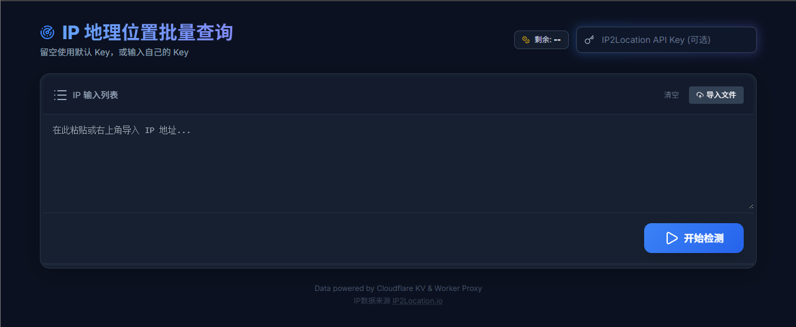
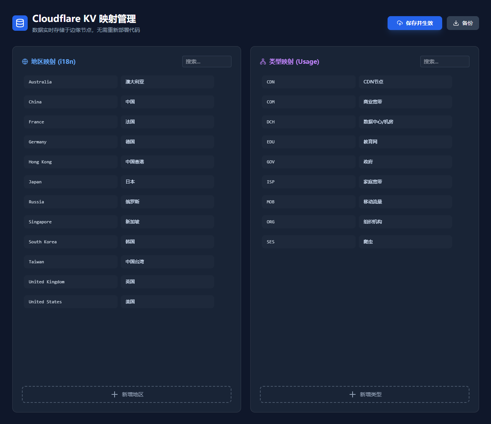

🌍 IP Batch Analyzer (Cloudflare Worker Edition)

这是一个基于 Cloudflare Workers 和 KV Storage 的 IP 批量检测工具。它支持批量查询 IP 地址的地理位置、ISP、代理状态等信息，并支持导出 Excel/CSV。

  <strong>在线体验:</strong> <a href="https://ip.li0il.ggff.net/">https://ip.li0il.ggff.net/</a>

✅ 主要特性：

🚀 Serverless 架构：无需服务器，完全运行在 Cloudflare 边缘节点。

🔒 隐私保护：前端不直接请求第三方 API，通过 Worker 代理转发，隐藏真实 IP 和 API Key。

🔑 灵活的 Key 策略：支持 用户自定义 Key > 服务端环境变量 Key > 官方免费无 Key 模式 三级自动切换。

📊 实时额度显示：自动解析 API 响应头，实时展示剩余查询配额（兼容点数/频次限制）。

📝 KV 数据管理：内置可视化后台，可在线修改国家/地区翻译和用途映射，实时生效。

📂 批量处理：支持复制粘贴或导入 .txt/.csv 文件，多线程并发查询。

🛠️ 部署教程 (Deployment)
1. 准备工作

注册一个 Cloudflare 账号。

(可选) 注册 ip2location.io 获取 API Key（免费版也可以）。

2. 创建 Cloudflare KV

我们需要一个 KV 命名空间来存储翻译和映射数据。

进入 Cloudflare Dashboard -> Workers & Pages -> KV.

点击 Create a Namespace。

命名为 IP_KV (或者其他你喜欢的名字)，点击 Add。

记住这个 Namespace ID，稍后配置会用到。

3. 创建 Worker

进入 Workers & Pages -> Overview -> Create Application.

点击 Create Worker，修改名称（例如 ip-tools），点击 Deploy。

点击 Edit code，将本项目中的 worker.js 代码完整复制进去。

点击 Save and deploy。

4. 绑定 KV 数据库

在 Worker 编辑页面，点击顶部的 Settings -> Variables.

找到 KV Namespace Bindings。

点击 Add binding：

Variable name: IP_KV (必须填这个，因为代码里写死是这个)。

KV Namespace: 选择你在第 2 步创建的那个数据库。

点击 Save and deploy。

5. 配置环境变量 (可选)

为了实现“隐藏 API Key”和“后台管理保护”，你需要设置环境变量。

在 Settings -> Variables -> Environment Variables 中添加：

变量名	说明	示例值
IP_API_KEY	(可选) IP2Location 的 API Key，用于兜底查询。	ABC12345...
ADMIN_TOKEN	(可选) 后台管理页面的访问密码。	mypassword123

保存并重新部署。

📖 使用说明 (Usage)
🏠 前台使用

访问你的 Worker 域名（例如 https://ip-tools.your-name.workers.dev）。

输入 IP：在文本框粘贴 IP 列表，或点击“导入文件”。

API Key 设置：

如果你有自己的 Key，可以在右上角输入。

如果留空，系统会自动尝试使用服务端配置的 Key。

如果服务端也没配置，将使用官方免费模式（每日 500 次）。

查看结果：点击“开始检测”，下方会显示详细表格。

导出：检测完成后，可点击导出 Excel 或 CSV。

⚙️ 后台管理 (KV Mapping)

访问 https://你的域名/admin。

功能：在这里你可以自定义“国家/地区”的中文翻译，以及“Usage Type”的中文解释。

保存：修改完成后，点击右上角“保存并生效”。

鉴权：系统会提示输入密码，请输入你在环境变量 ADMIN_TOKEN 中设置的值（默认为 123456）。

📝 常见问题 (FAQ)

Q: 为什么显示剩余额度是 "未知/不限"？
A: 如果你是 ip2location.io 的免费订阅或包月用户，API 响应头中可能不包含剩余点数信息。这是正常现象，依然可以正常使用。

Q: 如何获取映射数据的默认值？
A: 首次部署时 KV 是空的，代码内置了一份默认的 DEFAULT_DATA。你可以直接访问 /admin 点击保存，将其写入 KV。

Q: 是否支持其他 IP 库？
A: 目前代码深度绑定 ip2location.io 的 API 格式。如果需要支持 ipinfo.io 或其他库，需要修改 worker.js 中的 fetch 逻辑和数据解析逻辑。

📄 License

MIT License. Feel free to use and modify.

